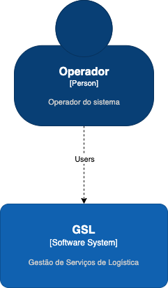
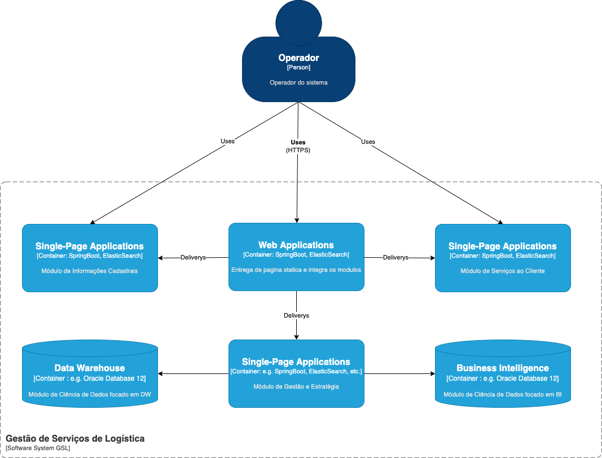
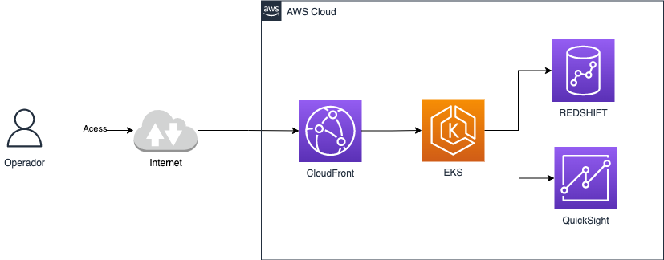

# SISTEMA DE LOGÍSTICA BASEADA EM MICROSSERVIÇOS

---
Sumario

1. OBJETIVOS DO TRABAL QUICKSIGHT
2. DESCRIÇÃO GERAL DA SOLUÇÃO	
   2.1. APRESENTAÇÃO DO PROBLEMA	
   2.2. DESCRIÇÃO GERAL DO SOFTWARE (ESCOPO)	
3. DEFINIÇÃO CONCEITUAL DA SOLUÇÃO	
   3.1. REQUISITOS FUNCIONAIS	
   3.2 REQUISITOS NÃO-FUNCIONAIS	
   3.3. RESTRIÇÕES ARQUITETURAIS	
   3.4. MECANISMOS ARQUITETURAIS	
4. MODELAGEM E PROJETO ARQUITETURAL	
   4.1. MODELO DE COMPONENTES	
   4.2. MODELO DE IMPLANTAÇÃO	
   4.3. MODELO DE DADOS (OPCIONAL)	
5. PROVA DE CONCEITO (POC) / PROTÓTIPO ARQUITETURAL	
   5.1. IMPLEMENTAÇÃO E IMPLANTAÇÃO	
   5.2 INTERFACES/ APIS	
6. AVALIAÇÃO DA ARQUITETURA	
   6.1. ANÁLISE DAS ABORDAGENS ARQUITETURAIS
   6.2. CENÁRIOS	
   6.3. AVALIAÇÃO	
   6.4.  RESULTADO	
7.  CONCLUSÃO	
    REFERÊNCIAS	
    APÊNDICES	

---

Trabalho de Conclusão de Curso de Especialização em Arquitetura de Software Distribuído como requisito parcial à obtenção do título de especialista.

PONTIFÍCIA UNIVERSIDADE CATÓLICA DE MINAS GERAIS
NÚCLEO DE EDUCAÇÃO A DISTÂNCIA
Pós-graduação Lato Sensu em Arquitetura de Software Distribuído

## RESUMO
O presente trabalho foi proposto considerando a importância da área de logística, particularmente no que se refere à entrega de produtos diversos aos consumidores, no atual contexto de pandemia. As pessoas, não podendo sair de casa para realizar suas compras do dia-a-dia, tem se servido de sites de ecommerce, tais como: supermercados, farmácias, lojas, entre outros. Como solução veremos nesse trabalho um modelo arquitetural proposto para o contexto baseado em micro serviços.
##### Palavras-chave: arquitetura de software, projeto de software, requisitos arquiteturais.

## 1. Objetivos do trabalho
O objetivo deste trabalho é apresentar a descrição do projeto arquitetural de uma aplicação para uma empresa fictícia de logística explorando o paradigma de micro serviços.
Os objetivos específicos são:
- Descrever os requisitos arquiteturais da aplicação;
- Propor um modelo de componentes;
- Propor um modelo de implementação baseada em cloud;

## 2. Descrição geral da solução
Esta seção se destina a descrever a solução arquitetural definida para a aplicação propos-ta. 
### 2.1. Apresentação do problema
O tema deste trabalho foi proposto considerando a importância da área de logística, particularmente no que se refere à entrega de produtos diversos aos consumidores, no atual contexto de pandemia.  As pessoas, não podendo sair de casa para realizar suas compras do dia a dia, tem se servido de sites de e-commerce, tais como: supermercados, farmácias, lojas, entre outros. Nesse contexto muitas empresas se especializaram em entregar essas mercadorias, tendo de disputar espaço nesse competitivo mercado. Em relação aos processos de logística envolvidos observa-se uma segmentação das etapas de entrega, passando pelos diversos trechos envolvidos. A primeira etapa do processo, que pode ser realizada uma ou mais de uma vez, envolve a movimentação das mercadorias desde um depósito ou centro de distribuição até outro, mais próximo do consumidor. A seguir é realizada a entrega, que é a etapa final do processo.

Visando contextualizar a empresa objeto desta análise, cujo nome fictício é Boa Entrega, considere tratar-se de uma transportadora de grande porte, com centenas de empresas clientes dos seus serviços de logística nos diversos municípios onde atua, em todo o território brasileiro. A Boa Entrega definiu milhares de rotas de entrega, fazendo uso de algoritmos de otimização para traçar esses caminhos. A escolha da melhor rota é realizada em tempo real utilizando recursos de geoprocessamento, a partir de bases de dados geográficas e mapas providos pela Google. Para que as rotas sejam definidas faz-se uso de serviços de acesso a dados e roteamento providos por empresas como a própria Google, Microsoft, Mapservice e outras. Diversos fatores influenciam no traçado de uma rota, sendo os três principais: a distância entre os endereços considerando as rotas possíveis, o custo da rota (em termos de gasto de combustível) e o tempo da rota (considerando o horário previsto para entrega). Toda entrega deve ser registrada no Sistema de Gestão de Entregas (SGE), até o final do dia do evento. Ao mesmo tempo que deve realizar entregas a transportadora deve cumprir metas. 

## 3. Definição conceitual da solução
Esta seção apresenta uma definição conceitual da solução a ser desenvolvida: requisitos funcionais e não funcionais, restrições e mecanismos arquiteturais considerados.
### 3.1. Requisitos Funcionais
1. Automatizar todos os processos de entrega realizados por ela, visando aprimorar os processos de apuração, conferência e faturamento e manter um nível de remuneração adequado;
2. Implementar integrações de seus sistemas com os de suas parceiras, de modo a propiciar que as entregas possam ser realizadas em parceria, em uma ou mais etapas do processo. Essas integrações requerem que os sistemas atuais sejam adaptados e novos componentes sejam incorporados visando a uma maior abertura, que será baseada na arquitetura orientada a serviços;
3. Utilizar geotecnologias em todos os processos que envolvam localização, de forma a facilitar a identificação e atualização de informações relativas às entregas agendadas e realizadas;
4. Tornar viável o uso de todas as tecnologias da informação e softwares necessários para atender às demandas dos clientes, fornecedores e parceiros, conforme definido neste documento.
### 3.2 Requisitos Não-Funcionais
1. Realizar todas as entregas com tempo médio inferior a 5 dias úteis;
2. Expandir a atuação para mais 200 municípios de pequeno/médio porte;
3. Passar a atuar na região norte do Brasil, último reduto que ela ainda não cobre, fazendo parcerias com uma empresa aérea e outras empresas de logística terrestre locais;
4. Desenvolver novas parcerias com outras transportadoras, visando complementar sua atuação em lugares onde ela apresenta maketshare inferior a 10%;
5. Fazer convênio com no mínimo 50 novos clientes, preferencialmente do ramo supermercadista;
6. Crescer 10% em termos de faturamento global.
### 3.3. Restrições Arquiteturais
1. Possuir características de aplicação distribuída: abertura, portabilidade, uso de recursos de rede;
2. Atender, de forma seletiva (por perfil) a clientes, fornecedores e colaboradores;
3. Ser modular e componentizado, utilizando orientação a serviços;
4. Ser de fácil implantação e utilização;
5. Ser hospedado em nuvem híbrida, sendo a forma de hospedagem documentada;
6. Suportar ambientes web e móveis;
7. Possuir interface responsiva;
8. Apresentar bom desempenho;
9. Apresentar boa manutenibilidade;
10. Ser testável em todas as suas funcionalidades;
11. Ser recuperável (resiliente) no caso da ocorrência de erro;
12. Utilizar APIs ou outros recursos adequados para consumo de serviços;
13. Estar disponível em horário integral (24 H), sete dias por semana;
14. Ser desenvolvido utilizando recursos de gestão de configuração, com integração contínua.

## 4. Modelagem e projeto arquitetural
Nesta seção são apresentados os diagramas que permitem entender a arquitetura da apli-cação, detalhando-a suficientemente para viabilizar sua implementação.
### 4.1. Modelo de componentes
Utilizarei o C4 Model como framework para diagramação apresentando nessa seção o nível 1 e o nível 2 desse projeto.

O nível 1: O diagrama de contexto do sistema

O nível 2: O diagrama de container

### 4.2. Modelo de implantação
Para a implementação dessa arquitetura utilizaremos a modalidade em nuvem tendo a AWS como provedor.

## 5. Prova de Conceito (POC) / protótipo arquitetural
Nesta parte do trabalho é apresentada a POC desenvolvida com o intuito de atender aos requisitos especificados neste relatório.

Além de descrever a POC, faz-se necessário deixar nesta seção o link do repositório da aplicação, lembrando que deve ser implementada somente parte da especificação fornecida.

### 5.1. Implementação e Implantação
Dentro do escopo desse trabalho, focaremos inicialmente na infraestrutura da aplicação e implementação de arquitetura na nuvem.

Quanto a implementação da aplicação na nuvem, utilizaremos o EKS como serviço gerenciado de Kubernetes para oferecer os serviços computacionais para os usuários. Dentro do EKS trabalharemos com a aplicação sendo um único namespace e as funcionalidades estando em PODs distribuídos. Utilizaremos o Redshift como serviço de DW que será consumido externamente pelo EKS e o QuickShint como serviço de BI também consumido externamente.

Utilizarei do mecanismo de História de Usuário para apresentar os requisitos funcionais que serão implementados para validar a arquitetura proposta.

**História de Usuário 1:** Eu como gerente de engenharia quero tornar viável o uso de todas as tecnologias da informação e softwares necessários para atender às demandas dos clientes,

**História de Usuário 2:** Eu como gerente de engenharia quero utilizar APIs ou outros recursos adequados para consumo de serviços.

**História de Usuário 3:** Eu como gerente de engenharia quero que a infraestrutura seja desenvolvida utilizando recursos de gestão de configuração, com integração contínua,

Para implementação utilizarei o Terraform. Todo código estará disponível no endereço: https://github.com/brbernardo/puc-tcc/tree/main/poc

## 6.  Conclusão
O objetivo deste trabalho foi apresentar um modelo arquitetural para sistemas de logística baseada em micro serviço. Vimos elementos arquiteturais como requisitos funcionais e não funcionais, diagramas de componentes baseados no C4 Model e nos aprofundamos na implementação da infraestrutura como mecanismo de teste do modelo arquitetural proposto.

## REFERÊNCIAS
Página da web, https://c4model.com/, vista em 2022.

## APÊNDICES
Repositório do projeto: https://github.com/brbernardo/puc-tcc

Repositório do código da POC: https://github.com/brbernardo/puc-tcc/tree/main/poc

